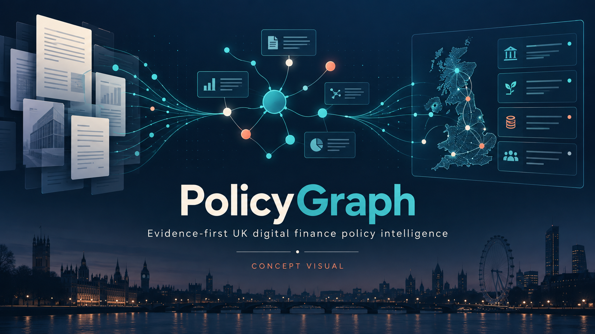
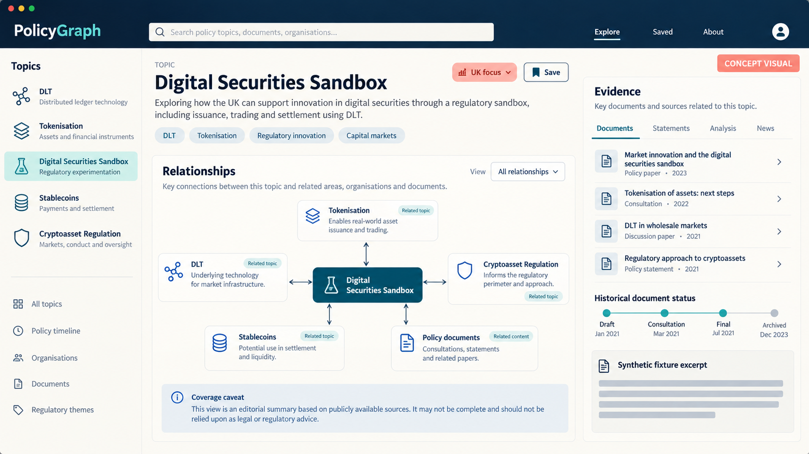
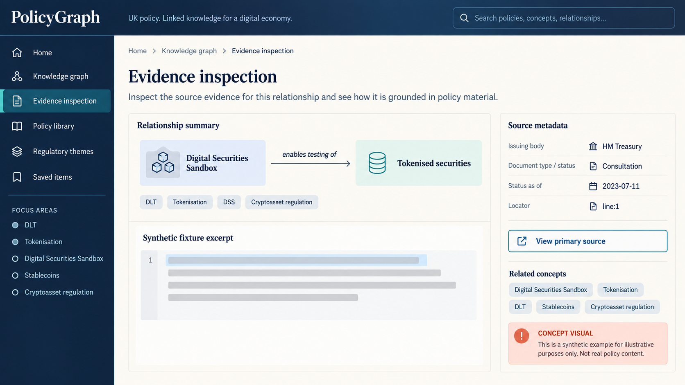
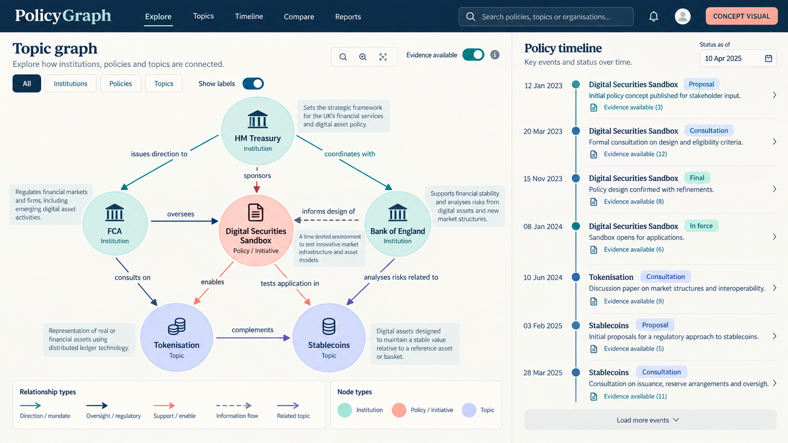
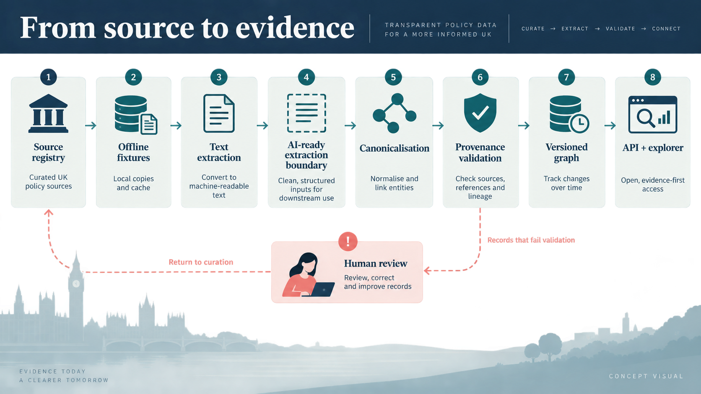

# PolicyGraph



> The interface images in this repository are AI-generated concept visuals, clearly marked in-image. They illustrate product direction and are not captures of implemented functionality or official policy material.

PolicyGraph is an open-source AI product-management proof of concept for exploring how UK digital-finance policy develops across distributed ledger technology (DLT), tokenisation, the Digital Securities Sandbox (DSS), stablecoins, and cryptoasset regulation.

The product idea is simple: policy professionals should be able to move from a topic or organisation to underlying events, relationships, claims, and evidence. Every status is the source document's status on an explicit `status_as_of` date, not a claim about current law in 2026.

> **Current status — v0.1.0 functional alpha.** The deterministic fixture pipeline, read-only API, responsive explorer, bounded golden evaluation, local wheel-content check, and CI workflow are implemented. PolicyGraph is AI-ready through a replaceable extraction boundary, but no working AI/LLM extractor ships. Synthetic-sample results do **not** establish production accuracy or user value; real-corpus and moderated-usability validation remain outstanding.



## Start here

- Understand the user problem and scope in the [product brief](docs/product/product-brief.md).
- See what exists now and what comes next in the [roadmap](docs/product/roadmap.md).
- Review the implemented system and trust boundaries in the [architecture](docs/architecture.md).
- Inspect the hypotheses and release gates in the [evaluation plan](docs/product/evaluation-plan.md).
- Contributors should then read [CONTRIBUTING.md](CONTRIBUTING.md).

## Why this exists

UK digital-finance policy is spread across regulators, government departments, legislation, consultations, speeches, and implementation updates. Search returns documents; it does not reliably explain how a policy changed, who influenced it, or what evidence supports a relationship. PolicyGraph tests whether a source-grounded graph can reduce time-to-insight while keeping users close to the evidence.

## Target users and outcome

The primary user is a policy or regulatory analyst who needs to build an evidence-backed view of a policy area. Secondary users are product/compliance leads and researchers. The validation hypothesis is that users can answer a scoped policy-history question in **under 10 minutes**, with **at least 90% citation correctness** and **zero unsupported material policy relationships** in the evaluated sample.

## Functional-alpha experience

1. Select a topic, entity, or policy event.
2. Explore linked event, entity, and relationship cards.
3. Inspect the exact source and evidence locator for all material policy claims and relationships.
4. Distinguish proposals and consultations from final or in-force measures.
5. Export or share an evidence trail (post-MVP).





## Repository map

```text
docs/                 Product, architecture, decisions, risks, and evaluation
plans/                Phased delivery plan
src/policygraph/      Typed pipeline and read-only FastAPI service
pipeline/             Pipeline contracts and operating notes
app/                  Accessible same-origin web experience
evals/                Reviewer-authored golden set and executable release gates
data/                 Curated registry, synthetic fixtures, and sample graph
.github/               Open-source community and automation configuration
```

Any upstream workspace reference directory is deliberately excluded from this publishable repository. Only files intentionally created inside this repository belong in a release.

## Product documentation

- [Product brief](docs/product/product-brief.md)
- [Personas and user journeys](docs/product/personas-and-journeys.md)
- [Opportunity-solution tree](docs/product/opportunity-solution-tree.md)
- [Service blueprint](docs/product/service-blueprint.md)
- [Prioritisation](docs/product/prioritisation.md)
- [Roadmap](docs/product/roadmap.md)
- [Backlog](docs/product/backlog.md)
- [Decision log](docs/product/decision-log.md)
- [Risk register](docs/product/risk-register.md)
- [Evaluation plan](docs/product/evaluation-plan.md)
- [Retrospective](docs/product/retrospective.md)
- [Architecture](docs/architecture.md)

## Responsible-use position

PolicyGraph is a research and navigation aid, not legal advice. AI-assisted extraction must remain reviewable, source-linked, evaluated, and replaceable. Confidence scores are not substitutes for evidence. The demo uses a small, curated public-source corpus and states coverage limits prominently.

## Run the functional alpha



Install the project in an isolated Python 3.12 environment, then start the app:

```bash
python -m pip install -e ".[dev]"
uvicorn policygraph.api:app --host 127.0.0.1 --port 8000
```

Open <http://127.0.0.1:8000>. The same process serves the interface and `/api/*`; interactive API documentation is at `/docs`. Run the core offline gates with `python -m pytest tests evals` and `python -m evals.evaluate`. The full release checklist is in [CONTRIBUTING.md](CONTRIBUTING.md).

Editable installs use the checkout's `app/` and `data/sample/` files. A wheel built locally has been verified to contain those runtime assets. CI performs the clean isolated build and archive inspection; its result is authoritative once the workflow runs.

## Contributing and governance

Contributions are welcome for the functional alpha. Read [CONTRIBUTING.md](CONTRIBUTING.md), [GOVERNANCE.md](GOVERNANCE.md), [SECURITY.md](SECURITY.md), and the [Code of Conduct](CODE_OF_CONDUCT.md). The project is licensed under the [MIT License](LICENSE); third-party source content retains its original rights.

## Citation

Use the metadata in [CITATION.cff](CITATION.cff). Cite original policy sources for policy claims; citing this repository is not a substitute for citing the primary evidence.
