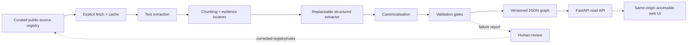
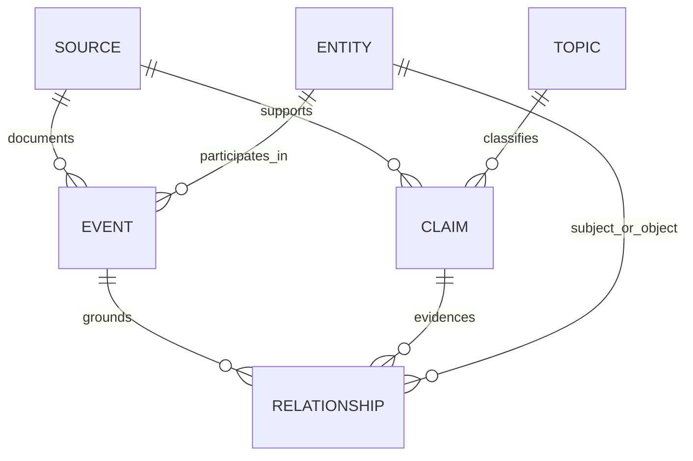

# Architecture

## Product and data flow



Every claim and relationship crossing the validation gate must retain a source identifier and locator. The diagram shows the intended full flow. The working POC runs local fixtures through the same adapter boundary, extracts text into located lines, reads deterministic claim markers, canonicalises entities and builds the validated graph. Cache/fetch and claim-extractor interfaces are available for extensions; no live network transport, LLM extractor or human-review console ships. Lines provide the POC's chunking boundary.

**Text description:** Curated source metadata flows through explicit retrieval, extraction, evidence-aware chunking, structured extraction, canonicalisation, and validation. Valid records become a versioned JSON graph consumed by a read-only API and accessible interface. Failed validation routes records to human review, which can correct the registry or transformation rules.

## Repository boundaries

```text
data/registry/       Curated source metadata intended for publication
data/sample/         Labelled derived demo graph and rights-reviewed fixtures
src/policygraph/      Fetch, extract, canonicalise, build, validate, read-only API
pipeline/            Operating notes and contracts
app/                 Static accessible interface
evals/               Golden set, evaluation runner, reports schema
docs/                Product contract, architecture, decisions, risks
```

Upstream workspace reference directories are outside this architecture and must never be copied, modified, or published.

## Conceptual graph model



**Text description:** A source supports claims and documents events; entities participate in events and act as the subject or object of relationships; events ground relationships; claims evidence relationships; and topics classify claims.

Core records include stable IDs, labels, dates where applicable, historical document status with `status_as_of`, provenance, and schema/build versions. Relationships are directed and typed; association is not presented as causation.

## Trust and security boundaries

- Remote source content is untrusted input and never executable configuration.
- The published API is read-only for the POC.
- CI has read-only repository permissions, no secrets, and no live network/model dependency.
- Source excerpts are minimised and included only after a documented rights review; original publishers retain rights in source material.
- Invalid or orphaned evidence fails the build instead of being silently omitted.

Implementation choices are recorded in the [decision log](product/decision-log.md).
