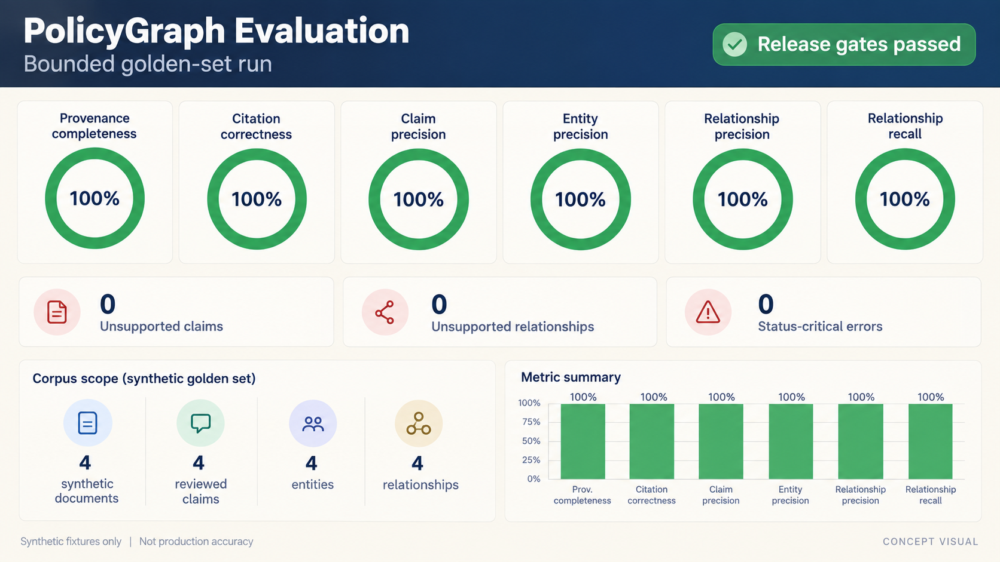

# Evaluation plan

## Purpose

The evaluation tests two linked propositions: the structured dataset is trustworthy enough for a bounded POC, and the experience helps analysts answer scoped questions faster without losing evidence quality.

## Dataset quality

Use a versioned golden set created through manual review of the curated sample. Evaluate:

| Metric | Definition | Gate |
|---|---|---:|
| Provenance completeness | Material policy claims and relationships with source ID + locator | 100% |
| Citation correctness | Records whose cited passage supports the represented claim | >=90% |
| Entity precision | Predicted canonical entities judged correct | >=90% |
| Relationship precision | Typed relationships judged supported | >=90% |
| Relationship recall | Reviewer-authored supported relationships present | 100% |
| Status-critical errors | Proposal/consultation/final/in-force misclassification | 0 |
| Unsupported relationships | Edges without supporting evidence | 0 |
| Determinism | Identical fixture input produces identical graph bytes | 100% |

Failures are reported, not averaged away. Status-critical and unsupported-relationship gates are release blockers even when aggregate precision passes.

## Product usability

Run five moderated sessions centred on one benchmark question per user. Capture task completion, completion time, evidence-opening behaviour, status interpretation, confidence, and qualitative friction.

Success targets:

- At least 4 of 5 participants complete the task without facilitator correction.
- Median completion time is under 10 minutes.
- All successful answers include at least one inspected primary source.
- No participant reports a proposal as in-force after viewing the relevant status.

## Benchmark design

Questions must be answerable inside the declared corpus, require at least two connected events or entities, and have a reviewer-authored evidence key. Hold back part of the golden set from extraction tuning. Record corpus version, extractor version, evaluator version, and run timestamp.

## Decision rules

- **Continue:** all safety gates pass and usability thresholds are met.
- **Iterate:** provenance/status gates pass but precision or usability misses; address the dominant failure mode and rerun.
- **Stop or narrow:** unsupported/status-critical errors persist, or users cannot understand coverage limits.

## Reporting

Publish aggregate results plus failure categories and known limitations. Do not describe targets as achieved before running the evaluation. Avoid publishing copyrighted source text beyond what is necessary and lawful for verification.

## Automated POC result

> **Concept visual:** AI-generated dashboard representation of the executable evaluation output. It is not evidence of production accuracy or user value.

The versioned reviewer-authored expectations live in `evals/golden.json`; they include exact source IDs, evidence locators, quotes, historical status dates, and supported relationships. `python -m evals.evaluate` checks citation correctness against those judgments and measures both relationship precision and recall, so changing evidence or deleting an expected edge fails. This proves regression resistance for a bounded synthetic sample—not general extraction quality.

The current bounded fixture run reports 100% provenance completeness, reviewer-approved citation agreement, claim/entity/relationship precision, and relationship recall, with zero status-critical errors and unsupported claims or relationships. These values describe agreement with the deliberately small reviewed fixture set. They must not be presented as real-corpus accuracy. Product-usability targets remain untested until five moderated sessions are completed.
