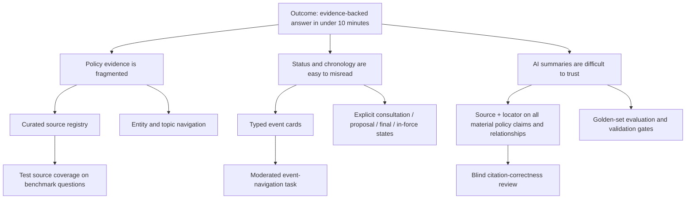

# Opportunity-solution tree

## Desired outcome

Reduce the time required to produce an evidence-backed understanding of a scoped UK digital-finance policy topic, without weakening provenance or policy-status accuracy.

**Text description:** The desired outcome branches into three opportunities: fragmented evidence, easily misread chronology/status, and low trust in AI summaries. Selected solutions are a curated registry and entity navigation; typed event cards and explicit policy states; and evidence locators plus golden-set validation. Each solution connects to an experiment below.

## Opportunity-to-experiment traceability

| Opportunity | Selected solution | Experiment | Success signal | Backlog |
|---|---|---|---|---|
| Evidence is fragmented | Curated registry and entity/topic navigation | Ask five users to answer a corpus-bounded benchmark question | At least 4/5 complete; median time <10 minutes | PG-01, PG-02, PG-07, PG-14 |
| Status and chronology are easy to misread | Typed event cards with explicit policy states | Give users a benchmark containing both proposal and in-force events | Zero status-critical interpretation errors | PG-05, PG-07, PG-14 |
| AI summaries are difficult to trust | Source and locator on all material policy claims and relationships | Blind-review a held-out golden set and observe evidence-opening behaviour | 100% provenance; >=90% citation correctness; every successful user inspects a primary source | PG-04, PG-09, PG-10, PG-11 |

## Selection logic

The planned MVP chooses curated coverage, typed chronology, and evidence-first graph exploration because these directly address the riskiest assumptions: that the graph saves time and that AI-assisted structure can remain auditable. Alerts, collaboration, broad crawling, and predictions do not test those assumptions and are deferred.

See [prioritisation](prioritisation.md) and [evaluation plan](evaluation-plan.md).
