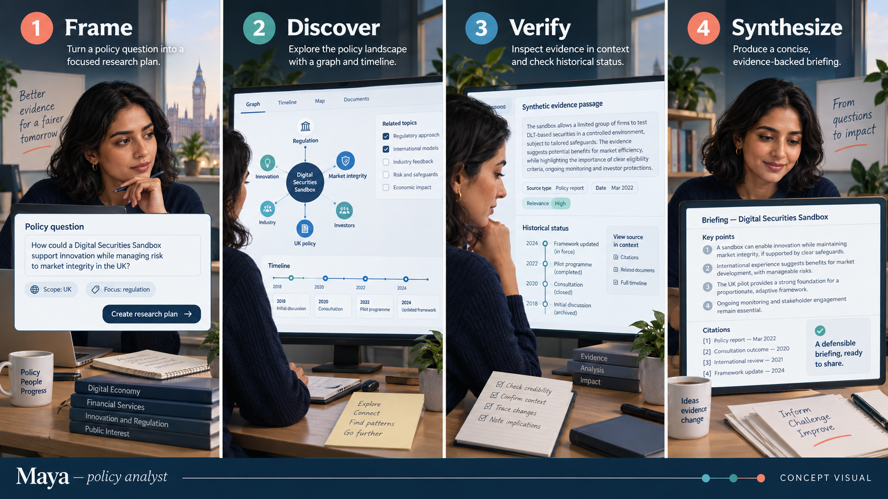

# Personas and user journeys

## Primary persona — Maya, policy analyst

> **Concept visual:** AI-generated illustration of the intended journey, not a usability-test recording or production screenshot.

Maya prepares time-sensitive briefings for senior decision-makers. She is comfortable reading legislation and regulator publications but cannot manually reconstruct every cross-institution dependency. She values primary evidence, dates, policy status, and defensible wording above novelty.

**Core job:** build an accurate account of how a UK digital-finance policy evolved and who acted.

**Failure anxiety:** presenting a consultation proposal as settled policy, or repeating a claim that cannot be traced to its source.

### Journey: evidence-backed policy history

| Stage | User action | Need | Planned product response | Measure |
|---|---|---|---|---|
| Frame | Selects “Digital Securities Sandbox” | Understand coverage | Scope, freshness, and caveat panel | Scope understood without help |
| Discover | Opens the event cards | Find pivotal events | Dated, status-labelled event cards | Relevant event found in <=2 min |
| Connect | Explores actors and relationships | Understand institutional roles | Typed graph edges with direction | Relationship interpreted correctly |
| Verify | Opens an evidence panel | Confirm a claim | Primary URL, title, date, locator, excerpt | Source reached in one action |
| Synthesize | Records an answer | Produce a defensible briefing | Compact evidence trail | Benchmark task <10 min |

## Secondary persona — Theo, fintech product lead

Theo needs an orientation to regulatory developments before consulting counsel. He wants clear status and affected domains, but may not know institutional vocabulary.

**Core job:** identify potentially relevant policy developments and the questions that require expert advice.

**Boundary:** the product must not convert this journey into a compliance recommendation.

## Secondary persona — Dr Aisha, researcher

Aisha studies policy networks and wants transparent source selection, reproducible structured data, and explicit ontology choices.

**Core job:** inspect connections and evaluate how the dataset was constructed.

## Accessibility and inclusion

The planned interface must support keyboard navigation, non-visual alternatives to the graph, readable status labels that do not rely on colour alone, plain-language definitions, and source-first navigation. Evaluation recruits should include users with different graph literacy and domain familiarity.
