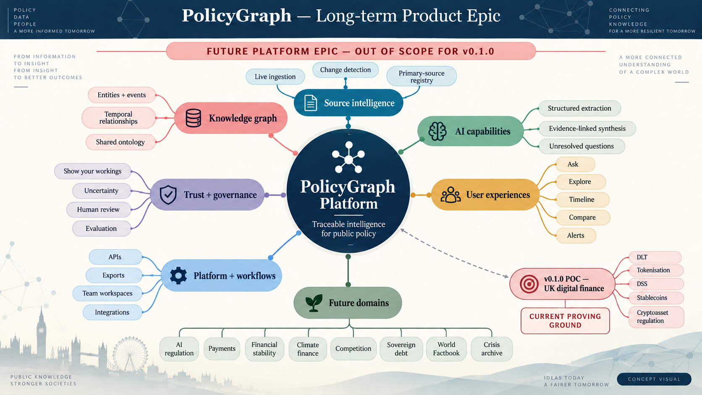

# Roadmap

## Long-term product epic

> **Concept visual:** AI-generated map of the larger, domain-general PolicyGraph ambition. With the exception of the small UK digital-finance proving ground, these capabilities and domains are explicitly outside the v0.1.0 POC and are not delivery commitments.

The image retains its original v0.1.0 design label. Its platform ambitions also remain outside the v0.2.0 ingestion-SDK release.

The longer-term epic is a traceable public-policy intelligence platform: continuously updated primary sources become temporal entities, events and relationships; AI supports structured extraction and evidence-linked synthesis; and users can ask, explore, compare and monitor policy change while inspecting the system's workings. Potential domains include AI regulation, payments, financial stability, climate finance, competition, sovereign debt, a wider World Factbook and financial-crisis archives.

## POC delivery roadmap

This is an outcome-led delivery roadmap; dates are intentionally unset until ownership and capacity are confirmed.

Version 0.2.0 is the functional POC described in the delivered rows below. It is not a validated MVP and does not contain a live AI extractor.

| Horizon | Outcome | Deliverables | Exit evidence |
|---|---|---|---|
| Delivered — Foundation | Make the product thesis and trust contract reviewable | Product artefacts, architecture, governance, repository skeleton | Internal-link check; scope/metric consistency review |
| Delivered — Reproducible data | Demonstrate a traceable source-to-graph transformation | Typed models, curated registry, adapters, deterministic fixtures, graph validation, CLI | Clean offline rebuild; every edge has provenance |
| Delivered — Functional alpha | Let users explore and verify the sample | FastAPI service, accessible web UI, linked topic/entity/event/relationship/source cards | API tests; structural keyboard and empty/error-state checks |
| Delivered — Engineering validation | Make the bounded POC reproducible and release-checkable | Golden-set evals, quality gates, relocatable package, least-privilege CI | Automated fixture gates and distribution checks pass |
| Delivered — Reusable ingestion SDK | Enable external contributions and reuse | Adapter protocol, plugin discovery, schemas, starter package, contribution guides | Contract tests, packaged fixture and installed-wheel validation |
| Then — Validate the MVP | Determine whether the functional alpha solves the user problem | Five moderated sessions and real-corpus evaluation | All mandatory thresholds in the evaluation plan pass and are reported honestly |
| Later — Learn and decide | Choose expand, pivot, or stop | Coverage experiments, workflow export research, operating-cost model | Decision memo based on observed evidence |

## Release boundary

The functional alpha is complete only when the deterministic sample can be regenerated, the app can display it, automated evaluations run offline, caveats are visible, and CI passes. It is a validated MVP only after the moderated product evaluation and mandatory quality gates pass. Repository publication alone is not a product validation result.
