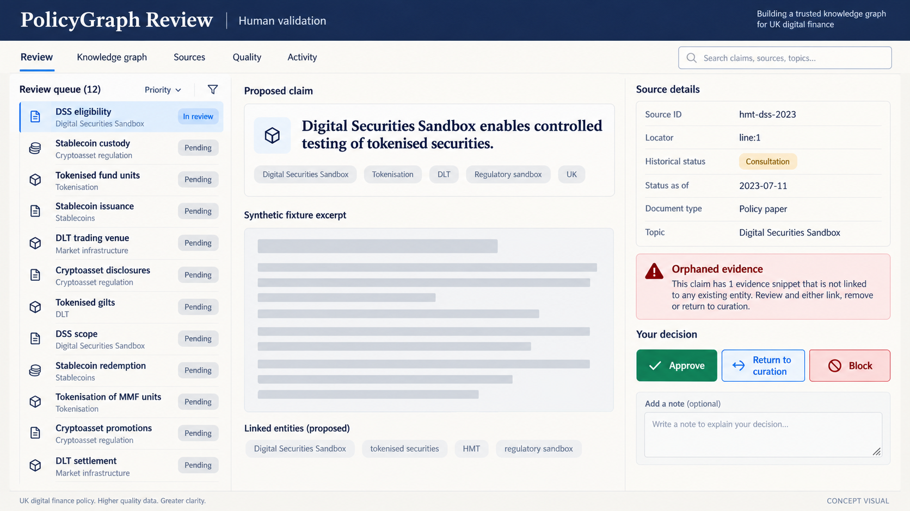

# Service blueprint

> **Concept visual:** AI-generated future-state review workflow. The functional alpha provides deterministic validation gates but does not ship this review console.

| Layer | Discover | Explore | Verify | Reproduce |
|---|---|---|---|---|
| User action | Choose topic/entity | Inspect linked event and relationship cards | Open claim evidence | Review dataset build |
| Visible experience | Coverage notice and topic choices | Linked entity, relationship and event cards | Source metadata, locator, excerpt, status | Build metadata and validation report |
| API/service | Read topic subgraph | Query entities/events/relationships | Resolve claim and source records | Return dataset version |
| Pipeline | Curate registry | Extract and canonicalise | Attach provenance | Validate and build deterministically |
| Controls | Scope label | Typed schema and status taxonomy | No claim without source+locator | Offline fixtures, golden set, quality gates |
| Failure response | Explain no coverage | Empty state; preserve uncertainty | Block orphaned claim; link original | Fail build with actionable report |

## Trust moments

The product earns trust when it exposes limitations before exploration, makes every edge inspectable, preserves policy status, and fails closed when provenance is missing. It loses trust if visual polish implies completeness or a confidence score hides weak evidence.

## Human role

AI may propose structured claims; deterministic validation and human review decide what enters a publishable graph. Users remain responsible for interpreting original sources and seeking professional advice where needed.

See [architecture](../architecture.md) and [risk register](risk-register.md).
